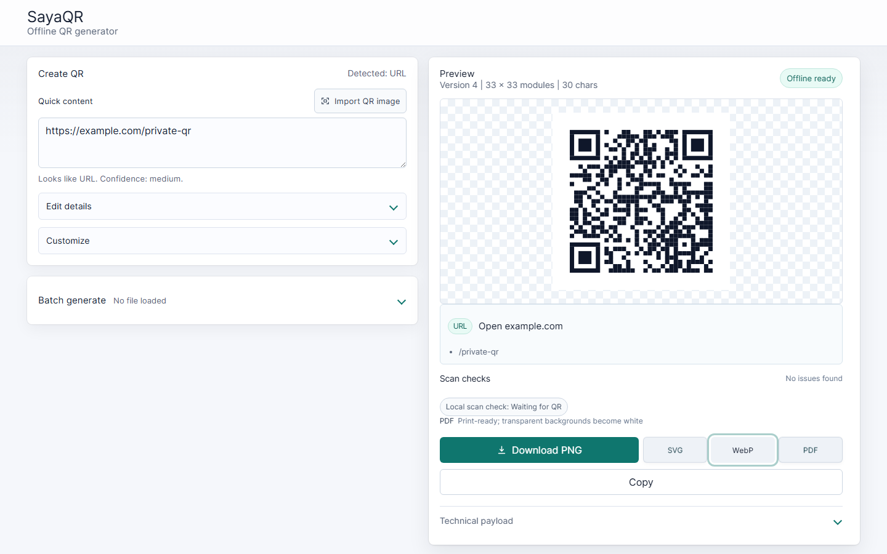

  
  <h1>SayaQR</h1>
  
<strong>Private QR codes, made entirely in your browser.</strong>

  
Generated locally. No tracking. No upload.

  

    <a href="https://subtlesayak.github.io/SayaQR/"><strong>Open SayaQR</strong></a>
    ·
    <a href="https://github.com/subtlesayak/SayaQR/releases/latest">Latest release</a>
    ·
    <a href="./CHANGELOG.md">Changelog</a>
  

  

    
    
    
    
  

  

SayaQR v1.9.5 · content → inspect → download

## Why SayaQR

| | |
| --- | --- |
| **Private by default** | QR content, passwords, contacts, payments, images, and batch files stay in your browser. |
| **Works offline** | Installable PWA with a locally cached app shell and no CDN dependency. |
| **Easy first, powerful later** | Paste content and download immediately; structured fields and design controls remain collapsed until needed. |
| **Open and inspectable** | Strict TypeScript, an MIT project license, and Nayuki's MIT-licensed QR encoder. |

## From content to QR

1. **Paste or type** content. SayaQR detects the QR type automatically.
2. **Inspect and style** the live QR while local scan checks flag risky choices.
3. **Download, copy, or share** without sending the payload anywhere.

## What you can create

| QR type | Useful for | QR type | Useful for |
| --- | --- | --- | --- |
| **Plain text** | Notes, labels, serials | **URL** | Websites and deep links |
| **Wi-Fi** | Network credentials | **Email** | Address, subject, and body |
| **SMS** | Number and prepared message | **Phone** | Tap-to-call links |
| **vCard** | Shareable contact details | **UPI** | Indian payment requests |
| **Event** | Calendar invitations | **Geo** | Coordinates and map labels |

## Built for real use

| Area | Included |
| --- | --- |
| **Intent-aware input** | Automatic type detection, structured field editing, human-readable previews, and content-aware filenames. |
| **Design controls** | Foreground and background colors, transparency, quiet zone, module size, rounded modules, finder style, and center logos. |
| **Scan safety** | Contrast, quiet-zone, logo-size, and payload-density warnings plus local blur, size, contrast, and rotation simulations. |
| **Flexible output** | Inline PNG, SVG, WebP, and WYSIWYG PDF downloads; image copy and native sharing when supported. |
| **Local QR import** | Decode QR screenshots through file selection, drag and drop, or paste without uploading the image. |
| **Batch generation** | CSV/TXT drag and drop, column suggestions, validation, deterministic filenames, cancellation, ZIP export, and error reports. |
| **Opt-in design memory** | Save visual preferences under `sayaqr:design:v1`; content and uploaded files are never persisted. |
| **Offline PWA** | Installable app, native share target, relative paths for GitHub Pages, and locally bundled dependencies. |

## Privacy by design

SayaQR has no backend and makes no content API calls. QR payloads, Wi-Fi passwords, UPI details, contacts, locations, events, imported images, custom logos, and batch rows remain on the device.

| Data | Behavior |
| --- | --- |
| QR content and structured fields | Used in memory for generation; never transmitted or persisted. |
| Imported QR images and custom logos | Decoded or rasterized locally; never uploaded. |
| Design preferences | Stored in localStorage only after **Use this design next time** is enabled. |
| Native share text | Uses a generic description and never includes the encoded payload. |

There is no analytics, advertising, account system, cloud storage, URL shortener, or redirect service.

## Exports that match the preview

| Format | Best for |
| --- | --- |
| **PNG** | Everyday sharing and documents |
| **SVG** | Design tools and scalable printing |
| **WebP** | Compact web images |
| **PDF** | Print-ready output |

SVG, PNG, WebP, PDF, clipboard copy, and native sharing all use the styled preview SVG as their canonical source. Colors, background, rounded modules, finder style, center logo, logo backing, quiet zone, and proportions stay consistent across formats.

PDF export embeds a lossless PNG at a minimum of 1600 × 1600 pixels. Transparent backgrounds become white for PDF because printed paper has a background.

Copy and Share appear only when the browser supports those capabilities. Installed PWAs can receive shared URLs or text; incoming share parameters are auto-detected locally and removed from browser history immediately.

> [!NOTE]
> Scan confidence is an advisory local simulation, not a guarantee. Always test styled or logo-heavy QR codes with the cameras and scanning apps your audience will use.

## Run locally

**Requirements:** Node.js 22+ and [pnpm](https://pnpm.io/).

~~~bash
# Install dependencies
pnpm install

# Start the development server
pnpm dev

# Run the test suite
pnpm test

# Build production assets
pnpm build

# Preview the production build
pnpm preview
~~~

The development server is available at `http://127.0.0.1:5173/` by default.

## Deployment

- **Live app:** [subtlesayak.github.io/SayaQR](https://subtlesayak.github.io/SayaQR/)
- **Latest release:** [github.com/subtlesayak/SayaQR/releases/latest](https://github.com/subtlesayak/SayaQR/releases/latest)
- **Deployment workflow:** [Deploy to GitHub Pages](https://github.com/subtlesayak/SayaQR/actions/workflows/deploy-pages.yml)

Pull requests run the test suite and production build. Every push to `main` rebuilds and deploys `dist/` to GitHub Pages, then creates the versioned GitHub release when its tag does not already exist.

SayaQR uses relative Vite paths, so the same production build can be hosted from a subpath on GitHub Pages or another static host. No server runtime is required.

## Contributing

Issues and pull requests are welcome. Please preserve the core product contract:

- browser-only and local-first
- no tracking, accounts, cloud storage, or content APIs
- advanced controls hidden until requested
- keyboard-accessible controls and mobile layouts without horizontal overflow
- tests and a production build before merge

## Credits and license

SayaQR is released under the [MIT License](./LICENSE).

- **QR encoding:** [Project Nayuki's QR Code generator](https://www.nayuki.io/page/qr-code-generator-library), vendored in `src/lib/nayuki-qrcodegen.ts` under the MIT License. The original copyright and permission notice are preserved.
- **QR decoding:** [jsQR](https://github.com/cozmo/jsQR), bundled locally under the Apache License 2.0.
- **Logo presets:** Local SVG path data from Material Design Icons, Simple Icons, and Wikimedia Commons where available. Brand names and marks remain the property of their respective owners.
- **Design inspiration:** [QRBTF](https://github.com/CPunisher/react-qrbtf) and [QRFrame](https://github.com/zhengkyl/qrframe) inspired the exploration of approachable QR styling. Their source code, UI, and assets are not copied into SayaQR.

The Nayuki encoder, jsQR decoder, logos, and all application dependencies are bundled locally. Generating or decoding a QR never requires a third-party request.

---

  Built by <a href="https://subtlesayak.github.io/"><strong>Subtle Sayak</strong></a>
  ·
  <a href="https://github.com/subtlesayak/SayaQR">GitHub</a>

